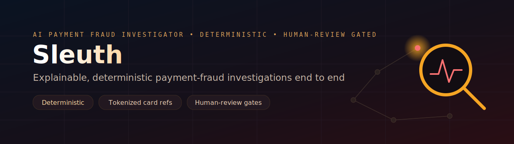

<p align="center">
  
</p>

# Sleuth &middot; AI Payment Fraud Investigator

Production-grade Agent Skills that automate payment fraud investigations end to
end. This pack replaces the repetitive triage performed by a human fraud analyst:
it ingests a transaction, enriches it with context, evaluates it against a suite
of fraud skills, scores risk, recommends a decision, and produces an explainable,
audit-ready case report.

Each skill is a self-contained folder with a `SKILL.md` that an AI agent loads on
demand. The same logic is implemented in a deterministic Python engine that runs
without any external model or credentials, so every skill has an executable
reference.

```
  INTAKE         ENRICH         DETECT         SCORE          DECIDE         REPORT
 ┌──────┐      ┌──────┐      ┌──────┐      ┌──────┐      ┌──────┐      ┌──────┐
 │ Open │ ───▶ │ Add  │ ───▶ │ Run  │ ───▶ │ Risk │ ───▶ │Policy│ ───▶ │ Case │
 │ Case │      │Context│     │Skills│      │Score │      │Verdict│     │Report│
 └──────┘      └──────┘      └──────┘      └──────┘      └──────┘      └──────┘
```

## Contents

- [Skills](#skills)
- [Agent Personas](#agent-personas)
- [Reference Material](#reference-material)
- [How Skills Work](#how-skills-work)
- [Project Structure](#project-structure)
- [Quick Start](#quick-start)
- [Memory and Learning](#memory-and-learning)
- [Input Format](#input-format)
- [Configuration](#configuration)
- [Containerized Execution](#containerized-execution)
- [Validation and Testing](#validation-and-testing)
- [Extending the Pack](#extending-the-pack)
- [Responsible Use](#responsible-use)
- [License](#license)

## Skills

The pack includes 13 skills: 1 meta-skill that routes work, plus 12 lifecycle
skills.

### Meta

| Skill | Use When |
| --- | --- |
| [using-fraud-investigator](skills/using-fraud-investigator/SKILL.md) | Starting an investigation or deciding which skill applies. |

### Intake and Enrichment

| Skill | Use When |
| --- | --- |
| [transaction-intake](skills/transaction-intake/SKILL.md) | Validating and normalizing a transaction into a case. |
| [data-enrichment](skills/data-enrichment/SKILL.md) | Adding device, history, and reference context. |

### Detection

| Skill | Use When |
| --- | --- |
| [transaction-analysis](skills/transaction-analysis/SKILL.md) | Checking for high value and unusual timing. |
| [velocity-analysis](skills/velocity-analysis/SKILL.md) | Detecting rapid bursts of activity or spend. |
| [geolocation-risk](skills/geolocation-risk/SKILL.md) | Detecting high-risk geography and impossible travel. |
| [device-fingerprinting](skills/device-fingerprinting/SKILL.md) | Detecting unknown or shared devices. |
| [watchlist-screening](skills/watchlist-screening/SKILL.md) | Screening against deny lists and watchlists. |
| [anomaly-detection](skills/anomaly-detection/SKILL.md) | Detecting statistical outliers versus account history. |
| [case-memory](skills/case-memory/SKILL.md) | Recalling adverse prior history for a repeat account or card. |

### Score, Decide, Report

| Skill | Use When |
| --- | --- |
| [risk-scoring](skills/risk-scoring/SKILL.md) | Aggregating signals into a single risk score. |
| [fraud-decisioning](skills/fraud-decisioning/SKILL.md) | Applying the policy to approve, escalate, or decline. |
| [investigation-reporting](skills/investigation-reporting/SKILL.md) | Producing the audit-ready case report. |

## Agent Personas

Pre-configured specialists for targeted work:

| Persona | Role | Focus |
| --- | --- | --- |
| [fraud-investigator](agents/fraud-investigator.md) | Senior Investigator | End-to-end investigation with a sign-off standard. |
| [risk-analyst](agents/risk-analyst.md) | Risk Analyst | Threshold and weight calibration with trade-off discipline. |
| [compliance-reviewer](agents/compliance-reviewer.md) | Compliance Reviewer | Explainability, fairness, and audit controls. |

## Reference Material

Quick-reference material that skills pull in when needed:

| Reference | Contents |
| --- | --- |
| [fraud-typologies.md](references/fraud-typologies.md) | Common fraud patterns and the skills that detect them. |
| [risk-scoring-rubric.md](references/risk-scoring-rubric.md) | Severity bands, confidence, and score interpretation. |
| [decision-policy.md](references/decision-policy.md) | Thresholds, outcomes, and governance. |
| [investigation-checklist.md](references/investigation-checklist.md) | Pre-close control checklist for every case. |
| [memory-and-learning.md](references/memory-and-learning.md) | Collective memory, recall, and the feedback loop. |

## How Skills Work

Every skill follows a consistent anatomy:

```
┌─────────────────────────────────────────────────┐
│  SKILL.md                                        │
│  ┌─ Frontmatter ─────────────────────────────┐   │
│  │ name: lowercase-hyphen-name               │   │
│  │ description: What it does. WHEN: triggers │   │
│  └───────────────────────────────────────────┘   │
│  Overview         → What the skill does          │
│  When to Use      → Triggering conditions        │
│  Process          → Step-by-step workflow        │
│  Rationalizations → Excuses + rebuttals          │
│  Red Flags        → Signs something is wrong      │
│  Verification     → Evidence requirements         │
└─────────────────────────────────────────────────┘
```

Design choices:

- **Process, not prose.** Skills are workflows with steps and exit criteria.
- **Determinism first.** The score and decision are reproducible. A language
  model may enrich the narrative only.
- **Verification is non-negotiable.** Every skill ends with evidence
  requirements.
- **Progressive disclosure.** `SKILL.md` is the entry point; references load only
  when needed.

## Project Structure

```text
.
├── skills/                     12 Agent Skills (1 meta + 11 lifecycle)
│   ├── using-fraud-investigator/   Meta: routing and shared rules
│   ├── transaction-intake/         Intake
│   ├── data-enrichment/            Enrich
│   ├── transaction-analysis/       Detect
│   ├── velocity-analysis/          Detect
│   ├── geolocation-risk/           Detect
│   ├── device-fingerprinting/      Detect
│   ├── watchlist-screening/        Detect
│   ├── anomaly-detection/          Detect
│   ├── case-memory/                Detect (collective memory recall)
│   ├── risk-scoring/               Score
│   ├── fraud-decisioning/          Decide
│   └── investigation-reporting/    Report
├── agents/                     3 specialist personas
├── references/                 5 supplementary references
├── template/                   Skill template (SKILL.md)
├── scripts/                    Skill validator
├── src/fraud_investigator/     Deterministic Python engine (executable reference)
│   ├── agents/                 Lifecycle agents
│   ├── skills/                 Fraud detection checks
│   ├── memory/                 Collective memory, recall, and feedback loop
│   ├── models/                 Pydantic domain models
│   ├── pipeline/               Batch and single-case orchestration
│   ├── llm/                    Optional LLM client and deterministic fallback
│   └── cli.py                  Command-line entry point
├── config/                     Engine configuration
├── data/samples/               Synthetic example dataset
├── tests/                      Unit and integration tests
├── plugin.json                 Skill pack manifest
├── Dockerfile                  Container image
├── docker-compose.yml          Local container orchestration
└── AGENTS.md                   Operating guide for AI agents
```

## Quick Start

### Use the Skills

Point your agent at this repository and open
[skills/using-fraud-investigator/SKILL.md](skills/using-fraud-investigator/SKILL.md).
It routes any request to the correct workflow. The folder layout follows the
Agent Skills convention, so the pack also works as a plugin manifest via
`plugin.json`.

### Run the Engine

```bash
python -m pip install -e ".[dev]"
fraud-investigator investigate data/samples/sample_transactions.json --output output
```

Print a full narrative report for the first case in a file:

```bash
fraud-investigator explain data/samples/sample_transactions.json
```

### Use the Python API

```python
from fraud_investigator.pipeline import InvestigationPipeline, load_cases_from_json

pipeline = InvestigationPipeline()
cases = load_cases_from_json("data/samples/sample_transactions.json")
results = pipeline.run_batch(cases)

for result in results:
    print(result.decision.outcome, result.decision.risk_score)
```

## Memory and Learning

The engine has an optional collective-memory and feedback loop, inspired by
adaptive-memory agent harnesses but kept fully deterministic. It is disabled by
default. See [references/memory-and-learning.md](references/memory-and-learning.md).

- **Collective memory.** Completed investigations are persisted to a local
  SQLite store using only pseudonymous accounts and tokenized cards.
- **Recall.** Prior cases for the same account or card are retrieved and injected
  during enrichment; the `case-memory` skill turns adverse history into a
  corroborating, non-critical signal.
- **Feedback loop.** Analysts label cases as `confirmed_fraud` or `legitimate`,
  and `calibrate` recommends thresholds from those labels. Calibration is
  advisory only and never mutates configuration.

```bash
# Persist and recall history during investigation
python -m fraud_investigator.cli investigate data/samples/sample_transactions.json --memory .fraud_memory/memory.db

# Label a stored case, then get advisory threshold recommendations
python -m fraud_investigator.cli feedback <case_id> confirmed_fraud --memory .fraud_memory/memory.db
python -m fraud_investigator.cli calibrate --memory .fraud_memory/memory.db
```

## Input Format

Each input file is a JSON array of case objects. A case contains a `transaction`,
an optional `account_history` array for context, and an optional `enrichment`
object carrying signals from upstream reference services. The model uses a
tokenized card reference and pseudonymous account identifiers; no raw cardholder
data is required or stored.

```json
[
  {
    "transaction": {
      "transaction_id": "txn_1001",
      "account_id": "acct_a1",
      "card_token": "tok_aaaa1111",
      "amount": 42.5,
      "currency": "USD",
      "timestamp": "2026-05-01T14:05:00Z",
      "merchant_id": "merch_coffee",
      "channel": "card_present"
    },
    "account_history": [],
    "enrichment": {}
  }
]
```

## Configuration

Engine behavior is controlled by [config/config.yaml](config/config.yaml) and
selected environment variables. Copy `.env.example` to `.env` to customize
runtime settings. See [references/decision-policy.md](references/decision-policy.md)
and [references/risk-scoring-rubric.md](references/risk-scoring-rubric.md) for the
scoring and decision model.

| Setting | Description |
| --- | --- |
| `decision_policy.decline_threshold` | Risk score at or above which a transaction is declined. |
| `decision_policy.escalate_threshold` | Risk score at or above which a case is escalated. |
| `skill_weights` | Relative contribution of each skill to the aggregate score. |
| `memory.enabled` | Persist investigations and recall prior history. Off by default. |
| `memory.path` | SQLite path for collective memory and analyst feedback. |
| `LLM_PROVIDER` | `none`, `openai`, or `azure_openai`. Defaults to deterministic mode. |

## Containerized Execution

```bash
docker compose up --build
```

Reports are written to the host `output/` directory.

## Validation and Testing

Validate the skill manifests and run the deterministic engine's test suite:

```bash
python scripts/validate_skills.py
pytest -q
```

## Extending the Pack

Copy `template/SKILL.md` into a new `skills/<name>/` folder, complete the
frontmatter and body, and, if executable, add the implementation under
`src/fraud_investigator/skills/` with a weight in `config/config.yaml`. See
[CONTRIBUTING.md](CONTRIBUTING.md) and [AGENTS.md](AGENTS.md).

## Responsible Use

This system assists and accelerates fraud investigation. Automated decisions,
particularly declines, must be governed by human oversight, customer-impact
review, and the compliance controls for your jurisdiction.

## License

Released under the MIT License. See [LICENSE](LICENSE).
