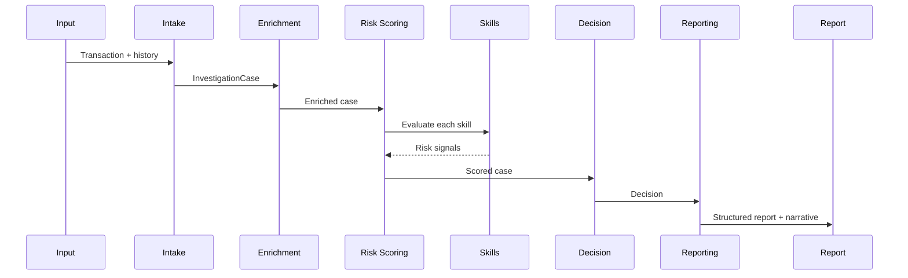

# Architecture Overview

This document describes the design of the AI Payment Fraud Investigator: its
components, the data that flows between them, and the rationale behind key
decisions. The goal of the system is to automate the routine work of a human
fraud investigator while remaining transparent, explainable, and auditable.

## Design Principles

1. **Explainability first.** Every risk contribution is a discrete signal with a
   severity, a confidence, and a human-readable rationale. The final decision
   cites the signals that produced it.
2. **Deterministic by default.** The engine runs end to end with no external
   model or network access. A language model is optional and only enhances the
   narrative; it never changes the risk score or the decision.
3. **Separation of concerns.** Skills perform detection. Agents perform
   orchestration. Models carry state. This keeps each part small and testable.
4. **Reproducibility.** Given the same input and configuration, the engine
   produces the same score and decision, which is essential for audits.

## Components

### Domain Models (`models/`)

Pydantic models define the contract between stages.

- `Transaction` and `GeoPoint` describe the event under review. The model uses a
  tokenized card reference and a pseudonymous account identifier; raw cardholder
  data is never required.
- `InvestigationCase` is the unit of work that flows through the pipeline. It
  accumulates enrichment, signals, and the aggregate risk score.
- `RiskSignal` is a single fraud indicator emitted by a skill.
- `Decision` is the terminal recommendation: approve, escalate, or decline.

### Skills (`skills/`)

A skill is a focused, deterministic fraud check that consumes a case and emits at
most one `RiskSignal`. Skills are isolated from each other and from orchestration
logic, so they can be developed, tested, and tuned independently. The registry
assembles the default skill suite from configuration.

### Agents (`agents/`)

Each agent owns one stage of the investigation:

- **Intake** validates input and opens a normalized case.
- **Enrichment** derives contextual features (for example, whether a device is
  known to the account) and merges any externally supplied reference data.
- **Risk Scoring** runs the skill suite and aggregates a weighted score.
- **Decision** applies the configurable policy to recommend an outcome.
- **Reporting** produces the narrative and the structured report.
- **Orchestrator** composes the stages into a single workflow.

### Pipeline (`pipeline/`)

The pipeline wraps the orchestrator with input loading and optional report
persistence, providing a stable entry point for both the CLI and application
code, for single cases and batches.

## Data Flow

## Risk Scoring Model

The aggregate risk score is a confidence-weighted, configuration-weighted blend
of triggered signal severities, bounded to the range 0-100. A blend is used
rather than a simple maximum so that the score is robust to a single noisy
signal while still responding strongly when multiple independent signals
corroborate one another. A small corroboration boost increases the score as the
number of independent triggers grows.

## Decision Policy

The decision agent maps the score to an outcome using two thresholds:

- At or above `decline_threshold`: **decline**.
- At or above `escalate_threshold`: **escalate** to human review.
- Below `escalate_threshold`: **approve** with passive monitoring.

Confidence is derived from how far the score sits from the relevant threshold and
from the agreement among signals. Thresholds are configurable per environment.

## Optional Language Model

The reporting agent attempts an LLM-generated narrative when a provider is
configured and reachable. On any failure, or when no provider is configured, it
uses a deterministic template-based narrative. This ensures the system degrades
gracefully and never blocks on external services.

## Extensibility

To add a new detection capability:

1. Subclass `Skill` and implement `evaluate`.
2. Register the class in `skills/registry.py`.
3. Add a weight under `skill_weights` in `config/config.yaml`.

No changes to agents or the pipeline are required, because skills interact only
through the `InvestigationCase` and `RiskSignal` contracts.
